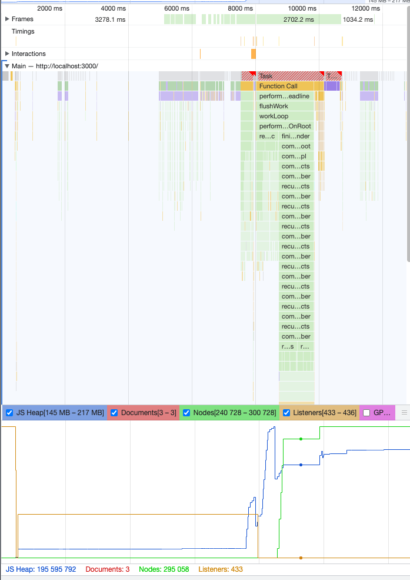

# Problem:

# Infinite Loader Assignment

## Initial Thoughts
I began by creating a list component to handle both the fetching and rendering of the data. But then i realized that the component should be generic, able to render anything thrown at it. So, i've implemented generics as types

## Generics and Parameters
I decided to use generic types to make the component flexible. This way, you can pass the `fetchData` and `renderItem` functions as parameters, letting the component handle any kind of data.

## Debouncing and Scrolling
Initially, I used the `handleScroll` event to check if the user had reached the bottom of the page. If they had, I'd fetch more data. But calling `fetchData` so frequently seemed not so performant. Thus debouncing! It ensures that we're not hammering the server with calls.

## Discovering Intersection Observer API
In my quest for optimization, I came across the Intersection Observer API. This seemed like a neat way to handle when to load more data, so I integrated it into the component.

## Performance Considerations
When dealing with a large dataset, performance is crucial. I did some experiments with lists containing 20,000 items and, spoiler alert, it wasn't pretty. Both the DOM nodes and JavaScript memory skyrocketed. I started using usememo for the items to calm down the memory usage but still virtualization should be the main performance gainer here, just like its being applied in mobile apps.

## The Virtualization Dilemma
To address this, I looked into virtualized list libraries like `react-window`. But my existing intersection observer setup stopped working. Using their infinite loading solution would defeat the purpose of my custom-built loader.

## The 'Load More' Button - Plan B
During my journey, I realized that the Intersection Observer API isn't 100% reliable. So, as a safety net, I added a 'Load More' button. This way, even if the observer fails to trigger, you can still manually load more data.

And there you have it, a quick rundown of my thought process while tackling this infinite loader assignment!

