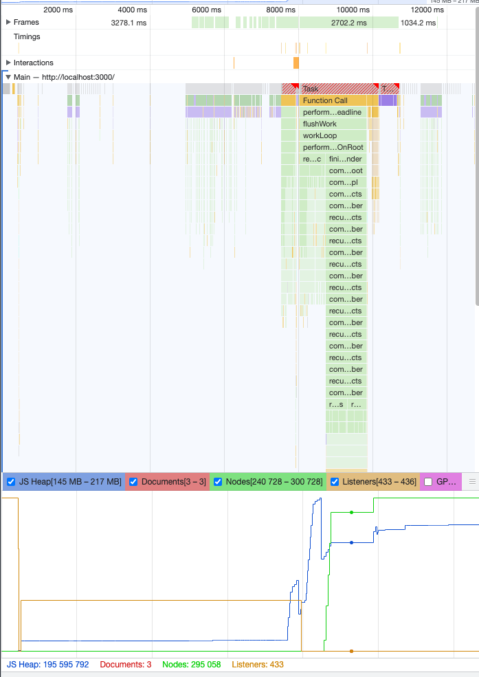

# Infinite Loader React Component

A highly adaptable and efficient infinite loader component, designed for React applications.

[TRY AT https://infinite-loader.vercel.app/](https://infinite-loader.vercel.app/)

## Introduction

This project focuses on creating a generic infinite loader component in React. The component is designed to be versatile, capable of handling any API with pagination and rendering diverse types of content. The emphasis was on creating a component that is not only functional but also considers performance optimization and user experience.

## Technologies Used

- React (leveraging latest hooks and paradigms)
- TypeScript for type safety and enhanced code quality
- Intersection Observer API for efficient, event-driven data loading

## Project Background

The infinite loader was developed as a technical challenge. It required creating a component that could seamlessly integrate with various APIs and dynamically render content based on the data fetched. A key aspect of the project was to ensure that the loader would perform efficiently, even with large datasets.

## Features

- **Generic Data Handling**: Capable of interfacing with any paginated API.
- **Dynamic Content Rendering**: Flexibility to render any type of content.
- **Performance Optimization**: Utilizes debouncing and the Intersection Observer API for efficient data loading.

## Thought Process and Development Strategy

### Performance and User Experience

- Initially handled data loading on scroll, but shifted to the Intersection Observer API for more efficient and event-driven data loading.
- Addressed performance issues with large datasets, experimenting with `useMemo` and considering virtualization for future improvements.
- During my journey, I realized that the Intersection Observer API isn't 100% reliable. So, as a safety net, I added a 'Load More' button. This way, even if the observer fails to trigger, you can still manually load more data.

#### Generics and Parameters
I decided to use generic types to make the component flexible. This way, you can pass the `fetchData` and `renderItem` functions as parameters, letting the component handle any kind of data.

#### Debouncing and Scrolling
Initially, I used the `handleScroll` event to check if the user had reached the bottom of the page. If they had, I'd fetch more data. But calling `fetchData` so frequently seemed not so performant. Thus debouncing! It ensures that we're not hammering the server with calls.

#### Discovering Intersection Observer API
In my quest for optimization, I came across the Intersection Observer API. This seemed like a neat way to handle when to load more data, so I integrated it into the component.

#### Performance Considerations
When dealing with a large dataset, performance is crucial. I did some experiments with lists containing 20,000 items and, spoiler alert, it wasn't pretty. Both the DOM nodes and JavaScript memory skyrocketed. I started using usememo for the items to calm down the memory usage but still virtualization should be the main performance gainer here, just like its being applied in mobile apps.

#### The Virtualization Dilemma
To address this, I looked into virtualized list libraries like `react-window`. But my existing intersection observer setup stopped working. Using their infinite loading solution would defeat the purpose of my custom-built loader.

#### The 'Load More' Button - Plan B
During my journey, I realized that the Intersection Observer API isn't 100% reliable. So, as a safety net, I added a 'Load More' button. This way, even if the observer fails to trigger, you can still manually load more data.

## Future Improvements

- Implement virtualization to handle extremely large datasets more efficiently.
- Further refine the Intersection Observer implementation for greater reliability.
- Explore more dynamic rendering options to enhance user experience.

## What I Learned

- **Dynamic Data Loading**: Mastered the integration and optimization of infinite loading mechanisms in a React application.
- **Intersection Observer API**: Gained hands-on experience with this modern API for efficient, event-driven data loading.
- **Virtualization Problem in React**: Intersection Observer API by itself will not be enough for ever growing ram consumption since we are keep appending html to our code.

## Initial Completion Date and Duration Spent

Aug 2023 - 10h+ spent
